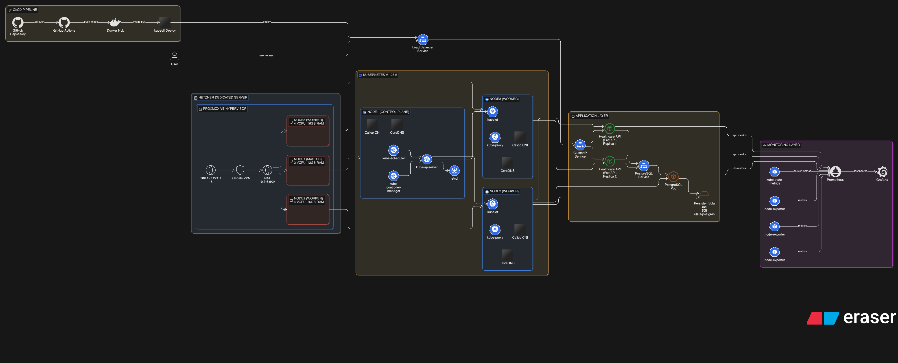

# Infrastructure Lab

**Target roles:** Platform Engineer, SRE, Infrastructure Engineer

Bare-metal Kubernetes platform demonstrating **security-hardened workloads**, **observability-driven operations**, and **chaos-validated resilience**.

**What this is:** A homelab used to learn by intentionally breaking systems.  
**What this is not:** Enterprise production infrastructure.

---

## Why I Built This

I wanted to understand Kubernetes beyond managed services. Running K8s on bare metal forces you to make decisions that cloud providers abstract away:

- How do you provision storage when there's no EBS?
- What happens when a node dies and you can't just spin up another?
- How do you secure workloads when you control the entire stack?

I also wanted to practice chaos engineering - intentionally breaking systems to understand failure modes before they happen in production. Reading about database failover is different from watching your PostgreSQL become unavailable for 25 hours because of a storage architecture decision.

This lab exists to answer: "What would I do differently if I had to rebuild this in production?"

---

## Stack



- **Physical:** Hetzner Dedicated (i7-6700, 64GB RAM)
- **Hypervisor:** Proxmox VE
- **Kubernetes:** v1.28 (3 nodes, Kubespray)
- **CNI:** Calico
- **Observability:** Prometheus + Grafana
- **Applications:** FastAPI, PostgreSQL

---

## Architecture
```
┌─────────────────────────────────────────────┐
│ Proxmox Host (Hetzner)                      │
│                                             │
│  ┌──────────┐  ┌─────────┐  ┌──────────┐  │
│  │ k8s-cp-1 │  │ k8s-w-1 │  │ k8s-w-2  │  │
│  │ Control  │  │ Worker  │  │ Worker   │  │
│  └──────────┘  └─────────┘  └──────────┘  │
└─────────────────────────────────────────────┘
         │
         ├─ Applications (healthcare-api)
         ├─ PostgreSQL (StatefulSet)
         └─ Monitoring (Prometheus/Grafana)
```

Single-cluster, single-region, single-control-plane by design.

---

## Security Posture

### Assumptions
- Any pod may be compromised  
- Internal traffic is untrusted  
- Repository is public  

### Controls
- Non-root containers  
- Read-only root filesystems  
- Dropped Linux capabilities  
- RuntimeDefault seccomp  
- Secrets via Kubernetes Secrets  
- Dedicated ServiceAccounts  
- RBAC least privilege  
- NetworkPolicies for isolation  
- No secrets in Git  

**Goal:** Reduce blast radius, not eliminate risk.

---

## What I Implemented

### Infrastructure
- Deployed 3-node Kubernetes cluster on bare metal
- Implemented Terraform-based VM provisioning on Proxmox
- Configured Kubespray for cluster bootstrapping
- Provisioned local persistent volumes for stateful workloads

### Security
- Enforced pod security contexts across all workloads
- Designed RBAC policies with least-privilege ServiceAccounts
- Migrated credentials to Kubernetes Secret objects
- Implemented NetworkPolicies for pod-to-pod isolation

### Observability
- Deployed Prometheus for metrics collection
- Built Grafana dashboards for cluster and application monitoring
- Integrated postgres_exporter for database performance metrics

### Operations
- Built GitHub Actions CI/CD pipeline with RBAC-restricted deployments
- Designed and executed 5 chaos engineering scenarios
- Documented failures in SRE-style postmortems

---

## Design Decisions & Trade-offs

### Local Storage
**Decision:** I provisioned local PersistentVolumes on worker nodes  

**Why:**
- Fast (no network overhead)
- Simple (no distributed storage complexity)
- Free (no additional infrastructure)

**Trade-off:**
- Node failure = data unavailable until recovery
- No automatic failover
- Single point of failure

**When to use:** Development, testing, non-critical workloads  
**When to avoid:** Production databases, stateful applications requiring HA

**What I'd do in production:** Longhorn/Rook for distributed storage, or external managed database

---

### Single Control Plane
**Decision:** I deployed one control plane node instead of HA setup

**Why:**
- Cheaper (fewer resources)
- Simpler (no etcd quorum complexity)
- Sufficient for learning environment

**Trade-off:**
- Control plane downtime = cluster unavailable
- No resilience to control plane failures

**When to use:** Labs, dev environments  
**When to avoid:** Production

**What I'd do in production:** 3+ control plane nodes with load balancer

---

### StatefulSet vs Deployment
**Decision:** I migrated PostgreSQL from Deployment to StatefulSet

**Why:**
- Stable pod identity (postgres-0 always)
- Dedicated PVC per pod
- Ordered startup/shutdown
- Foundation for replication

**Trade-off:**
- More complex than Deployment
- Manual PV management (no dynamic provisioner)

**When to use:** Databases, stateful applications  
**When to avoid:** Stateless apps

---

### Security Context Strictness
**Decision:** I enforced non-root, read-only FS, and dropped all capabilities

**Why:**
- Reduces attack surface
- Forces explicit permission requirements
- Industry best practice

**Trade-off:**
- Application compatibility issues
- Debugging complexity
- More initial configuration

**When to use:** Always  
**When to avoid:** Never - this should be default

---

### CI/CD with ServiceAccount Tokens
**Decision:** I implemented RBAC-restricted ServiceAccount instead of kubeconfig

**Why:**
- Least privilege (can only patch deployments)
- Auditable (ServiceAccount identity in logs)
- No kubeconfig secret management

**Trade-off:**
- More setup complexity
- Requires RBAC knowledge

**When to use:** Always  
**When to avoid:** Never - kubeconfig in CI is dangerous

---

## Chaos Tests

I designed and executed:

1. Pod CrashLoopBackOff (bad rollout)
2. Node failure (local storage outage)
3. Deployment → StatefulSet migration
4. Memory OOM kill
5. PostgreSQL monitoring instrumentation

Postmortems in `/postmortems/`.

---

## Key Findings

### Node Failure
- Local PV = single point of failure  
- PostgreSQL unavailable for 25 hours  
- Data intact but inaccessible  

**Lesson:** HA storage or external DB required for production.

### Memory OOM
- Container killed at memory limit (137)  
- Recovered in ~10 seconds  
- Multi-replica API remained available  

**Lesson:** Memory limits are hard ceilings.

### Cost vs Scaling
- CPU <25% even at failure point  
- Bottleneck was DB connections  
- Infra scaling did not solve problem  

**Lesson:** Measure before scaling.

---

## What I Can Now Do

After completing this lab, I can now:

### Platform Operations
- Operate Kubernetes clusters without managed control planes
- Design and provision storage for stateful workloads
- Build Infrastructure as Code pipelines with Terraform
- Implement GitOps-style deployment workflows

### Security Engineering
- Design and enforce pod-level security baselines across workloads
- Implement least-privilege RBAC policies
- Manage secrets without committing credentials to Git
- Configure network isolation with NetworkPolicies

### Chaos Engineering
- Design systematic failure scenarios
- Execute controlled chaos tests
- Write SRE-style postmortems with root cause analysis
- Validate system resilience through intentional breaking

### Observability
- Build metrics collection pipelines with Prometheus
- Create operational dashboards in Grafana
- Instrument applications for monitoring
- Diagnose performance bottlenecks through metrics

### Engineering Judgment
- Evaluate infrastructure trade-offs (cost vs complexity vs capability)
- Choose appropriate architectures for scale requirements
- Identify when simple solutions outperform complex ones
- Measure system behavior instead of assuming bottlenecks

---

## Repository Layout
```
infrastructure/
├── terraform/
└── BUILD_LOG.md

kubernetes/
├── applications/
│   ├── healthcare-api/
│   └── postgresql/
└── monitoring/

postmortems/
chaos/
docs/
```

---

## Rebuild Time

Target: **< 4 hours**  
Bare metal → functioning cluster

I validated this during clean rebuilds.

---

## Related Projects

- Multi-node Kubernetes with Terraform  
  https://github.com/ibraheemcisse/multi-node-kubernetes-cluster

- AWS Infrastructure Trade-offs  
  https://github.com/ibraheemcisse/devops-dashboard

- KEDA Autoscaling on EKS  
  https://github.com/ibraheemcisse/KEDA-HTTP-Add-On-with-Autoscaling-on-Kubernetes-EKS-

---

## Demonstrates

- Infrastructure provisioning  
- Kubernetes security hardening  
- Chaos engineering  
- Postmortem-driven improvement  
- Cost/performance analysis  

---

## Does NOT Demonstrate

- Multi-region HA  
- Managed cloud platforms  
- Enterprise-scale ops  
- Perfect security  

Learning environment, not reference architecture.

---

## Philosophy

- Security is a posture  
- Documentation reflects reality  
- Chaos validates assumptions  
- Trade-offs must be explicit  
- Complexity requires justification  

---

This project reflects how I approach engineering: build, break, measure, document, and iterate.

---

## License

MIT
